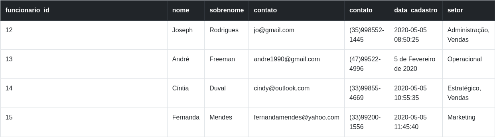
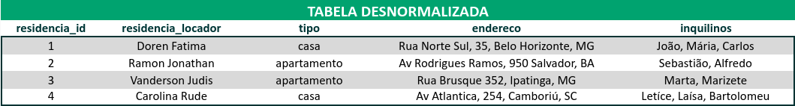
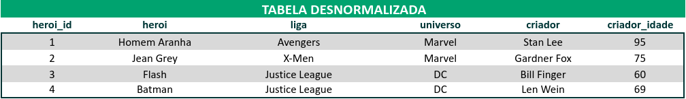
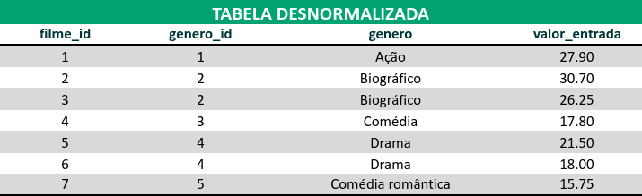

# Exercícios

## De Fixação
1. 🚀 Normalize a tabela a seguir para a 1ª Forma Normal.
Não se preocupe em montar a estrutura em código `SQL` neste primeiro momento. Crie apenas uma planilha (Excel, Google Sheets, Open Office Calc ou semelhantes) da estrutura esperada.

2. 🚀 Usando a estrutura (já normalizada para 1ª Forma Normal) da tabela anterior, transforme-a agora na 2ª Forma Normal.
3. 🚀 Monte uma query que:
  - Crie um banco de dados chamado `normalization`;
  - Crie todas as tabelas resultantes do exercício 2 (na 2ª Forma Normal);
  - Popule todas as tabelas com os dados fornecidos nos exercícios.

## Exercícos sobre Normalização
1. 🚀 Um zoológico precisa de um banco de dados para armazenar informações sobre os seus animais. As informações a serem armazenadas sobre cada animal são:
  - Nome;
  - Espécie;
  - Sexo;
  - Idade;
  - Localização.
Cada animal também possui vários cuidadores, e cada cuidador pode ser responsável por mais de um animal. Além disso, cada cuidador possui um gerente, sendo que cada gerente pode ser responsável por mais de um cuidador.

2. 🚀 Converta a tabela desnormalizada abaixo para a 1ª Forma Normal.

3. 🚀 Converta a tabela desnormalizada abaixo (que já está nos padrões da 1ª Forma Normal) para a 2ª Forma Normal.

4. 🚀 Agora, converta essa outra tabela (que já está nos moldes das duas primeiras formas) para a 3ª Forma Normal.

